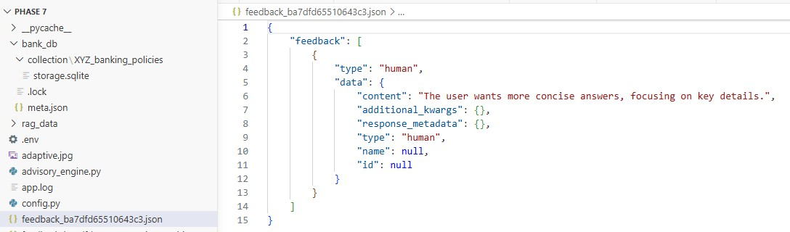
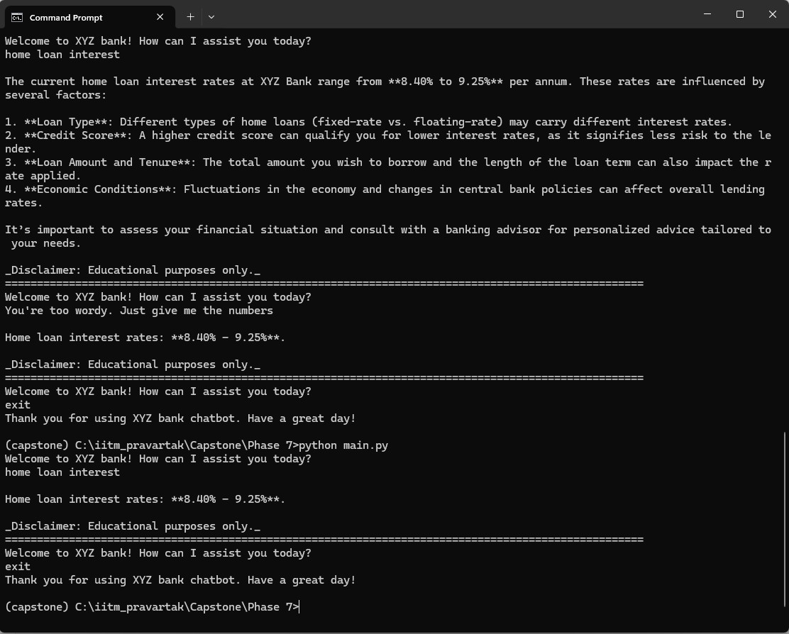

## Store feedback for future interactions
- Feedback is stored in the `feedback_<session_id>.json` file. Only the latest feedback is saved and loaded to maintain conversational consistency.


## Modify behaviour based on feedback


## Demonstrate before vs after behaviour
```
2026-04-22 17:56:27,961 UTC - INFO - User query: exit
2026-04-22 17:56:27,961 UTC - INFO - User requested to exit.
2026-04-22 17:58:58,415 UTC - INFO - HTTP Request: POST https://openai.vocareum.com/v1/embeddings "HTTP/1.1 200 OK"
2026-04-22 17:58:59,464 UTC - INFO - XYZ Bank Chatbot initialized and ready to receive queries.
2026-04-22 17:58:59,464 UTC - INFO - Session ID: ba7dfd65510643c3
2026-04-22 17:59:09,474 UTC - INFO - User query: home loan interest
2026-04-22 17:59:11,603 UTC - INFO - HTTP Request: POST https://openai.vocareum.com/v1/chat/completions "HTTP/1.1 200 OK"
2026-04-22 17:59:11,613 UTC - INFO - Intent classification result: {'intent': 'loan_inquiry', 'confidence_score': 0.95, 'feedback': None}
2026-04-22 17:59:11,619 UTC - INFO - No feedback found for session ba7dfd65510643c3
2026-04-22 17:59:13,014 UTC - INFO - HTTP Request: POST https://openai.vocareum.com/v1/chat/completions "HTTP/1.1 200 OK"
2026-04-22 17:59:15,231 UTC - INFO - Agent Final Answer: The current home loan interest rates at XYZ Bank range from **8.40% to 9.25%** per annum. These rates are influenced by several factors:

1. **Loan Type**: Different types of home loans (fixed-rate vs. floating-rate) may carry different interest rates.
2. **Credit Score**: A higher credit score can qualify you for lower interest rates, as it signifies less risk to the lender.
3. **Loan Amount and Tenure**: The total amount you wish to borrow and the length of the loan term can also impact the rate applied.
4. **Economic Conditions**: Fluctuations in the economy and changes in central bank policies can affect overall lending rates.

It’s important to assess your financial situation and consult with a banking advisor for personalized advice tailored to your needs. 

_Disclaimer: Educational purposes only._
2026-04-22 18:01:19,883 UTC - INFO - User query: You're too wordy. Just give me the numbers
2026-04-22 18:01:23,102 UTC - INFO - HTTP Request: POST https://openai.vocareum.com/v1/chat/completions "HTTP/1.1 200 OK"
2026-04-22 18:01:23,106 UTC - INFO - Intent classification result: {'intent': 'feedback', 'confidence_score': 0.85, 'feedback': 'The user wants more concise answers, focusing on key details.'}
2026-04-22 18:01:23,106 UTC - INFO - Storing user feedback: The user wants more concise answers, focusing on key details.
2026-04-22 18:01:23,107 UTC - INFO - Feedback stored for session ba7dfd65510643c3
2026-04-22 18:01:23,111 UTC - INFO - Feedback loaded for session ba7dfd65510643c3
2026-04-22 18:01:25,322 UTC - INFO - HTTP Request: POST https://openai.vocareum.com/v1/chat/completions "HTTP/1.1 200 OK"
2026-04-22 18:01:25,999 UTC - INFO - Agent Final Answer: Home loan interest rates: **8.40% - 9.25%**.

_Disclaimer: Educational purposes only._
2026-04-22 18:01:31,838 UTC - INFO - User query: exit
2026-04-22 18:01:31,838 UTC - INFO - User requested to exit.
2026-04-22 18:01:39,456 UTC - INFO - HTTP Request: POST https://openai.vocareum.com/v1/embeddings "HTTP/1.1 200 OK"
2026-04-22 18:01:39,691 UTC - INFO - XYZ Bank Chatbot initialized and ready to receive queries.
2026-04-22 18:01:39,691 UTC - INFO - Session ID: ba7dfd65510643c3
2026-04-22 18:02:12,282 UTC - INFO - User query: home loan interest
2026-04-22 18:02:16,249 UTC - INFO - HTTP Request: POST https://openai.vocareum.com/v1/chat/completions "HTTP/1.1 200 OK"
2026-04-22 18:02:16,260 UTC - INFO - Intent classification result: {'intent': 'loan_inquiry', 'confidence_score': 0.95, 'feedback': None}
2026-04-22 18:02:16,266 UTC - INFO - Feedback loaded for session ba7dfd65510643c3
2026-04-22 18:02:18,246 UTC - INFO - HTTP Request: POST https://openai.vocareum.com/v1/chat/completions "HTTP/1.1 200 OK"
2026-04-22 18:02:18,256 UTC - INFO - Agent Final Answer: Home loan interest rates: **8.40% - 9.25%**.

_Disclaimer: Educational purposes only._
2026-04-22 18:02:28,650 UTC - INFO - User query: exit
2026-04-22 18:02:28,651 UTC - INFO - User requested to exit.
```

## Explain what changed and why
- Without feedback agent gives the answer based on the user query without considering user preference. The answer was totally based on LLM thinking. With feedback as can be seen in the earlier section we can change the tone of the conversation as per user requirement. For example instead of providing multi-line answers now the agent can provide concise answers.
