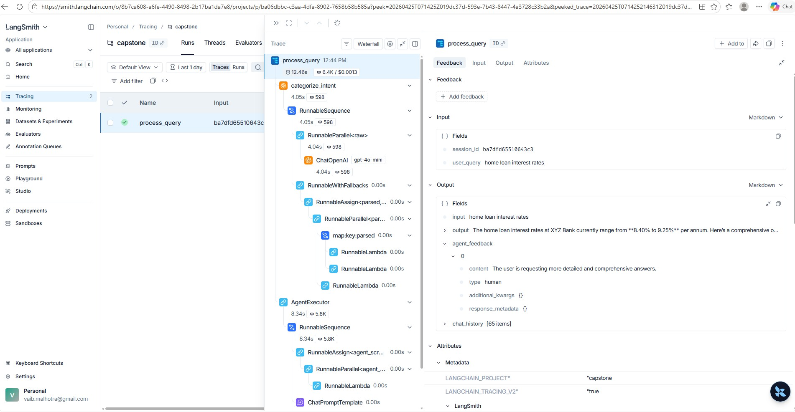
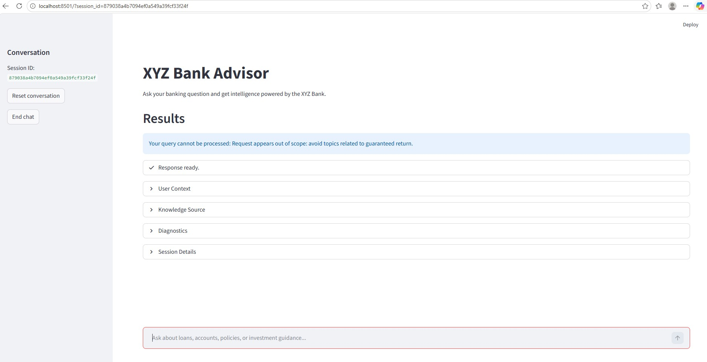

## Deploy locally or on the cloud 
```bash
pip install -r requirements.txt
```

## Capture latency and error logs 

### Latency
- Latency based on the short and concise response feedback
```
2026-04-26 07:29:10,738 UTC - INFO - Async function 'categorize_intent' executed in 2.449931 seconds
2026-04-26 07:29:13,216 UTC - INFO - Async function 'process_query' executed in 5.022604 seconds
```

- Latency based on the detailed response fedback
```
2026-04-25 17:46:12,247 UTC - INFO - Async function 'categorize_intent' executed in 1.800180 seconds
2026-04-25 17:46:25,769 UTC - INFO - Async function 'process_query' executed in 15.382759 seconds
```

- Langsmith tracing


### Error logs
```
2026-05-01 13:24:46,518 UTC - INFO - Agent Action: Using tool 'advisory_engine' with input '{'query': 'lost my card'}'
2026-05-01 13:24:46,538 UTC - INFO - Advisory engine retrieval intent: loan_inquiry
2026-05-01 13:24:46,541 UTC - ERROR - Error: Advisory engine exception: module 'qdrant_client.http.models.models' has no attribute 'Filte'
Traceback (most recent call last):
  File "C:\iitm_pravartak\Capstone\Phase 8\backend\advisory_engine.py", line 54, in advisory_engine
    "filter": rest.Filte(
              ^^^^^^^^^^
AttributeError: module 'qdrant_client.http.models.models' has no attribute 'Filte'. Did you mean: 'Filter'?

2026-05-01 13:24:46,562 UTC - ERROR - Error: Error during agent execution: module 'qdrant_client.http.models.models' has no attribute 'Filte'
Traceback (most recent call last):
  File "C:\iitm_pravartak\Capstone\Phase 8\backend\query_processor.py", line 149, in process_query
    response = await agent_executor.ainvoke(args)
               ^^^^^^^^^^^^^^^^^^^^^^^^^^^^^^^^^^
  File "c:\iitm_pravartak\Capstone\capstone\Lib\site-packages\langchain_classic\chains\base.py", line 222, in ainvoke
    await self._acall(inputs, run_manager=run_manager)
  File "c:\iitm_pravartak\Capstone\capstone\Lib\site-packages\langchain_classic\agents\agent.py", line 1646, in _acall
    next_step_output = await self._atake_next_step(
                       ^^^^^^^^^^^^^^^^^^^^^^^^^^^^
    ...<5 lines>...
    )
    ^
  File "c:\iitm_pravartak\Capstone\capstone\Lib\site-packages\langchain_classic\agents\agent.py", line 1428, in _atake_next_step
    [
    ^
    ...<8 lines>...
    ],
    ^
  File "c:\iitm_pravartak\Capstone\capstone\Lib\site-packages\langchain_classic\agents\agent.py", line 1511, in _aiter_next_step
    result = await asyncio.gather(
             ^^^^^^^^^^^^^^^^^^^^^
    ...<9 lines>...
    )
    ^
  File "c:\iitm_pravartak\Capstone\capstone\Lib\site-packages\langchain_classic\agents\agent.py", line 1549, in _aperform_agent_action
    observation = await tool.arun(
                  ^^^^^^^^^^^^^^^^
    ...<5 lines>...
    )
    ^
  File "c:\iitm_pravartak\Capstone\capstone\Lib\site-packages\langchain_core\tools\base.py", line 1131, in arun
    raise error_to_raise
  File "c:\iitm_pravartak\Capstone\capstone\Lib\site-packages\langchain_core\tools\base.py", line 1097, in arun
    response = await coro_with_context(coro, context)
               ^^^^^^^^^^^^^^^^^^^^^^^^^^^^^^^^^^^^^^
  File "c:\iitm_pravartak\Capstone\capstone\Lib\site-packages\langchain_core\tools\structured.py", line 124, in _arun
    return await self.coroutine(*args, **kwargs)
           ^^^^^^^^^^^^^^^^^^^^^^^^^^^^^^^^^^^^^
  File "c:\iitm_pravartak\Capstone\capstone\Lib\site-packages\langsmith\run_helpers.py", line 631, in async_wrapper
    function_result = await asyncio.create_task(  # type: ignore[call-arg]
                      ^^^^^^^^^^^^^^^^^^^^^^^^^^^^^^^^^^^^^^^^^^^^^^^^^^^^
        fr_coro, context=run_container["context"]
        ^^^^^^^^^^^^^^^^^^^^^^^^^^^^^^^^^^^^^^^^^
    )
    ^
  File "C:\iitm_pravartak\Capstone\Phase 8\backend\advisory_engine.py", line 54, in advisory_engine
    "filter": rest.Filte(
              ^^^^^^^^^^
AttributeError: module 'qdrant_client.http.models.models' has no attribute 'Filte'. Did you mean: 'Filter'?
```


## Demonstrate graceful failure handling 
- Introduced one error to showcase graceful handling
```
2026-05-01 13:28:37,779 UTC - INFO - HTTP Request: POST https://api.openai.com/v1/embeddings "HTTP/1.1 200 OK"
2026-05-01 13:28:53,863 UTC - ERROR - Error: Error during intent classification: 'coroutine' object has no attribute 'dict'
2026-05-01 13:28:53,867 UTC - INFO - Async function 'categorize_intent' executed in 0.004561 seconds
2026-05-01 13:28:53,867 UTC - INFO - Intent classification result: {'intent': 'unknown', 'confidence_score': 0.0, 'feedback': None}
2026-05-01 13:28:53,867 UTC - WARNING - Warning: Low confidence in intent classification: {'intent': 'unknown', 'confidence_score': 0.0, 'feedback': None}
2026-05-01 13:28:53,868 UTC - INFO - Async function 'process_query' executed in 0.177799 seconds
```


- Added additional pre-check guardrail for the user queries
```
2026-05-01 13:31:58,772 UTC - INFO - HTTP Request: POST https://api.openai.com/v1/embeddings "HTTP/1.1 200 OK"
2026-05-01 13:32:31,817 UTC - WARNING - Warning: Guardrail pre-check failed: Request appears out of scope: avoid topics related to guaranteed return.
2026-05-01 13:32:31,818 UTC - INFO - Async function 'process_query' executed in 0.132045 seconds
```


## Document deployment assumptions and limitations 

### Deplyment assumptions
- Python 3.11+ should be installed
- Virtual environment should be set using `venv`
- Required python packages should be installed using `pip install -r requirements.txt`

### Deployment limitations
- Missing docker deployment
