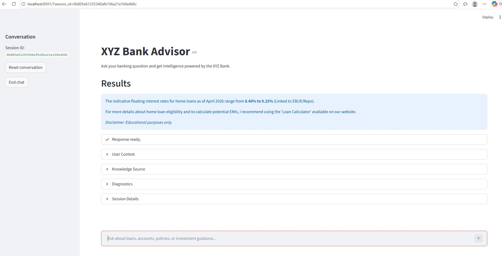
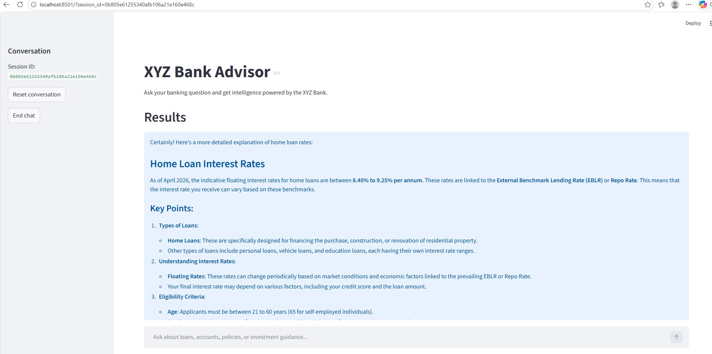
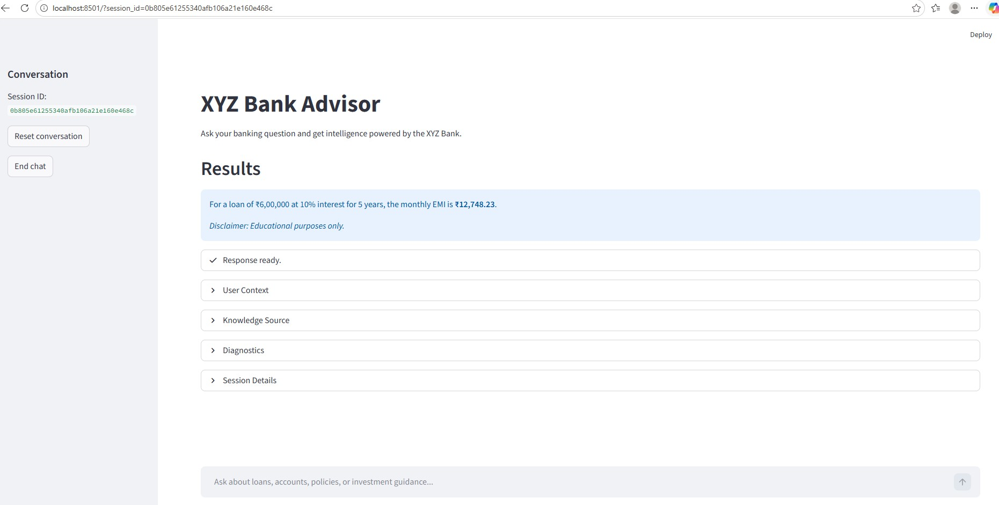
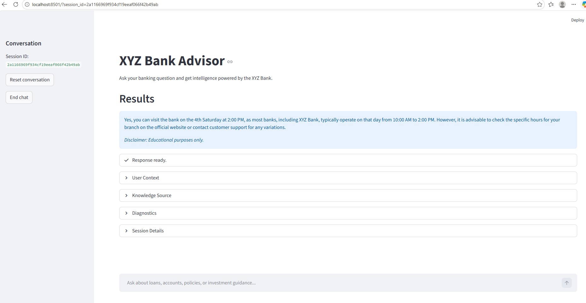
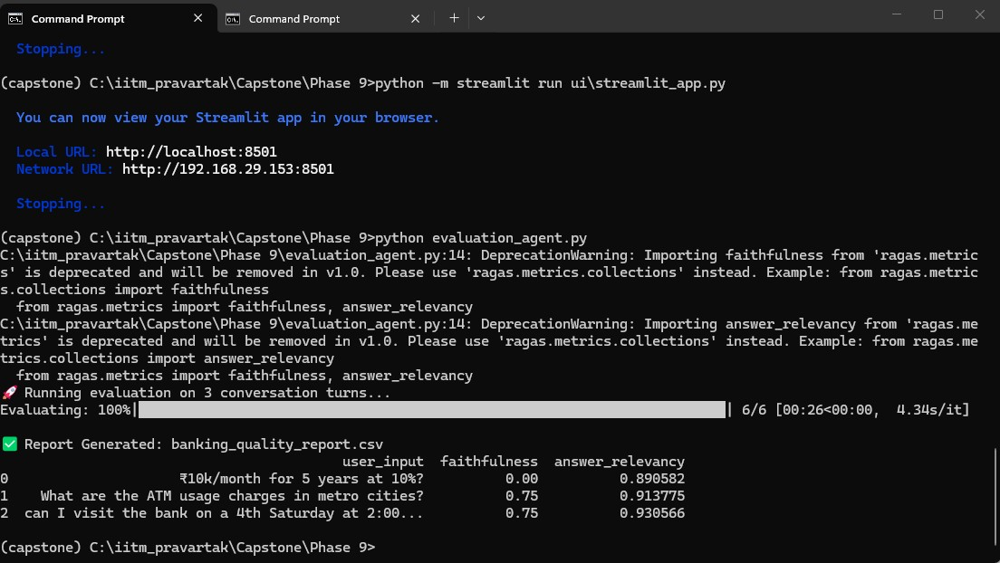

## Create evaluation prompts and test scenarios 
| Scenario | Input Query | Response | Status | Metric Score (0-1) |
|-------|-----|-----------|-----------|-----------|
| Accuracy | What are the home loan rates? |  | Pass | 1 |
| Adaptability | You are too concise give me complete explanation |  | Pass | 1 |
| Logic | ₹10k/month for 5 years at 10%? |  | Pass | 1 |
| Policy Adherence | can I visit the bank on a 4th Saturday at 2:00 PM? |  | Pass | 0 |

## Measure quality and consistency metrics 
- Using ragas for measuring the response quality
`python evaluation_agent.py`



## Perform root cause analysis
- Issue: Same query two different reponses
```
2026-05-02 06:04:38,973 UTC - INFO - Received query: can I visit the bank on a 4th Saturday at 2:00 PM? (Session ID: 0b805e61255340afb106a21e160e468c)
2026-05-02 06:04:40,032 UTC - INFO - HTTP Request: POST https://api.openai.com/v1/chat/completions "HTTP/1.1 200 OK"
2026-05-02 06:04:40,060 UTC - INFO - Intent classification raw output: content='{"category":"general_faq","confidence":0.97,"feedback":null}' additional_kwargs={'parsed': IntentTag(category='general_faq', confidence=0.97, feedback=None), 'refusal': None} response_metadata={'token_usage': {'completion_tokens': 17, 'prompt_tokens': 595, 'total_tokens': 612, 'completion_tokens_details': {'accepted_prediction_tokens': 0, 'audio_tokens': 0, 'reasoning_tokens': 0, 'rejected_prediction_tokens': 0}, 'prompt_tokens_details': {'audio_tokens': 0, 'cached_tokens': 0}}, 'model_provider': 'openai', 'model_name': 'gpt-4o-mini-2024-07-18', 'system_fingerprint': 'fp_6f731aea6a', 'id': 'chatcmpl-Daxkt6l7dU3ZJATpBbV05KelTGMGl', 'service_tier': 'default', 'finish_reason': 'stop', 'logprobs': None} id='lc_run--019de749-fcfa-7311-aa5e-edbf11f66c7c-0' tool_calls=[] invalid_tool_calls=[] usage_metadata={'input_tokens': 595, 'output_tokens': 17, 'total_tokens': 612, 'input_token_details': {'audio': 0, 'cache_read': 0}, 'output_token_details': {'audio': 0, 'reasoning': 0}}
2026-05-02 06:04:40,060 UTC - INFO - Intent classification parsed output: <class 'models.IntentTag'>
2026-05-02 06:04:40,060 UTC - INFO - Async function 'categorize_intent' executed in 1.028853 seconds
2026-05-02 06:04:40,060 UTC - INFO - Intent classification result: {'intent': 'general_faq', 'confidence_score': 0.97, 'feedback': None}
2026-05-02 06:04:40,061 UTC - INFO - Feedback loaded for session 0b805e61255340afb106a21e160e468c
2026-05-02 06:04:40,922 UTC - INFO - HTTP Request: POST https://api.openai.com/v1/chat/completions "HTTP/1.1 200 OK"
2026-05-02 06:04:41,545 UTC - INFO - Agent Final Answer: No, the bank is closed on the 4th Saturday. 

_Disclaimer: Educational purposes only._
2026-05-02 06:04:41,549 UTC - INFO - Async function 'process_query' executed in 2.521996 seconds
2026-05-02 06:05:43,456 UTC - INFO - Removed session artifact: history_0b805e61255340afb106a21e160e468c.json
2026-05-02 06:05:43,457 UTC - INFO - Removed session artifact: feedback_0b805e61255340afb106a21e160e468c.json
2026-05-02 06:05:49,240 UTC - INFO - Qdrant client closed successfully.
2026-05-02 06:06:59,437 UTC - INFO - HTTP Request: POST https://api.openai.com/v1/embeddings "HTTP/1.1 200 OK"
2026-05-02 06:07:02,528 UTC - INFO - Received query: None (Session ID: 2a1166969f934cf19eeaf066f42b49ab)
2026-05-02 06:07:21,993 UTC - INFO - Received query: can I visit the bank on a 4th Saturday at 2:00 PM? (Session ID: 2a1166969f934cf19eeaf066f42b49ab)
2026-05-02 06:07:23,230 UTC - INFO - HTTP Request: POST https://api.openai.com/v1/chat/completions "HTTP/1.1 200 OK"
2026-05-02 06:07:23,307 UTC - INFO - Intent classification raw output: content='{"category":"general_faq","confidence":0.92,"feedback":null}' additional_kwargs={'parsed': IntentTag(category='general_faq', confidence=0.92, feedback=None), 'refusal': None} response_metadata={'token_usage': {'completion_tokens': 17, 'prompt_tokens': 595, 'total_tokens': 612, 'completion_tokens_details': {'accepted_prediction_tokens': 0, 'audio_tokens': 0, 'reasoning_tokens': 0, 'rejected_prediction_tokens': 0}, 'prompt_tokens_details': {'audio_tokens': 0, 'cached_tokens': 0}}, 'model_provider': 'openai', 'model_name': 'gpt-4o-mini-2024-07-18', 'system_fingerprint': 'fp_6f731aea6a', 'id': 'chatcmpl-DaxnWLM5UNFwP3l8mLHxRpRyLlMrT', 'service_tier': 'default', 'finish_reason': 'stop', 'logprobs': None} id='lc_run--019de74c-7a50-7e52-8fe9-a6c6ef4fe813-0' tool_calls=[] invalid_tool_calls=[] usage_metadata={'input_tokens': 595, 'output_tokens': 17, 'total_tokens': 612, 'input_token_details': {'audio': 0, 'cache_read': 0}, 'output_token_details': {'audio': 0, 'reasoning': 0}}
2026-05-02 06:07:23,307 UTC - INFO - Intent classification parsed output: <class 'models.IntentTag'>
2026-05-02 06:07:23,308 UTC - INFO - Async function 'categorize_intent' executed in 1.126348 seconds
2026-05-02 06:07:23,308 UTC - INFO - Intent classification result: {'intent': 'general_faq', 'confidence_score': 0.92, 'feedback': None}
2026-05-02 06:07:23,308 UTC - INFO - No feedback found for session 2a1166969f934cf19eeaf066f42b49ab
2026-05-02 06:07:24,229 UTC - INFO - HTTP Request: POST https://api.openai.com/v1/chat/completions "HTTP/1.1 200 OK"
2026-05-02 06:07:24,377 UTC - INFO - Streamlit status progress: Searching the banking knowledge base...
2026-05-02 06:07:24,379 UTC - INFO - Agent Action: Using tool 'advisory_engine' with input '{'query': 'bank hours on 4th Saturday'}'
2026-05-02 06:07:24,390 UTC - INFO - Advisory engine retrieval intent: loan_inquiry
2026-05-02 06:07:25,667 UTC - INFO - HTTP Request: POST https://api.openai.com/v1/embeddings "HTTP/1.1 200 OK"
2026-05-02 06:07:25,699 UTC - INFO - Retrieved chunk from rag_data/loan.pdf (page 0):
2026-05-02 06:07:25,700 UTC - INFO - Retrieved chunk from rag_data/loan.pdf (page 0):
2026-05-02 06:07:25,700 UTC - INFO - Retrieved chunk from rag_data/loan.pdf (page 0):
2026-05-02 06:07:25,700 UTC - INFO - Retrieved chunk from rag_data/loan.pdf (page 0):
2026-05-02 06:07:27,323 UTC - INFO - HTTP Request: POST https://api.openai.com/v1/chat/completions "HTTP/1.1 200 OK"
2026-05-02 06:07:27,389 UTC - INFO - Advisory engine result: {'raw': AIMessage(content='{"advice":"Most banks, including XYZ Bank, typically operate on the 4th Saturday of each month from 10:00 AM to 2:00 PM. However, it\'s advisable to check the specific branch\'s hours on the official website or contact customer support for any variations."}', additional_kwargs={'parsed': FinancialState(advice="Most banks, including XYZ Bank, typically operate on the 4th Saturday of each month from 10:00 AM to 2:00 PM. However, it's advisable to check the specific branch's hours on the official website or contact customer support for any variations."), 'refusal': None}, response_metadata={'token_usage': {'completion_tokens': 59, 'prompt_tokens': 945, 'total_tokens': 1004, 'completion_tokens_details': {'accepted_prediction_tokens': 0, 'audio_tokens': 0, 'reasoning_tokens': 0, 'rejected_prediction_tokens': 0}, 'prompt_tokens_details': {'audio_tokens': 0, 'cached_tokens': 0}}, 'model_provider': 'openai', 'model_name': 'gpt-4o-mini-2024-07-18', 'system_fingerprint': 'fp_9075db19fa', 'id': 'chatcmpl-DaxnaXLVWzhRRyr87so1HJRqS5VDc', 'service_tier': 'default', 'finish_reason': 'stop', 'logprobs': None}, id='lc_run--019de74c-8807-7012-93d4-6914de30a5ca-0', tool_calls=[], invalid_tool_calls=[], usage_metadata={'input_tokens': 945, 'output_tokens': 59, 'total_tokens': 1004, 'input_token_details': {'audio': 0, 'cache_read': 0}, 'output_token_details': {'audio': 0, 'reasoning': 0}}), 'parsed': FinancialState(advice="Most banks, including XYZ Bank, typically operate on the 4th Saturday of each month from 10:00 AM to 2:00 PM. However, it's advisable to check the specific branch's hours on the official website or contact customer support for any variations."), 'parsing_error': None}
2026-05-02 06:07:28,181 UTC - INFO - HTTP Request: POST https://api.openai.com/v1/chat/completions "HTTP/1.1 200 OK"
2026-05-02 06:07:29,849 UTC - INFO - Agent Final Answer: Yes, you can visit the bank on the 4th Saturday at 2:00 PM, as most banks, including XYZ Bank, typically operate on that day from 10:00 AM to 2:00 PM. However, it is advisable to check the specific hours for your branch on the official website or contact customer support for any variations.

_Disclaimer: Educational purposes only._
2026-05-02 06:07:29,857 UTC - INFO - Async function 'process_query' executed in 7.807276 seconds
2026-05-02 06:09:15,411 UTC - INFO - Qdrant client closed successfully.
```

- RCA & Fix:
```
The inconsistent responses happened because the same general_faq query followed different execution paths. In one run, the agent answered directly from the LLM without using the knowledge base. In another run, it called advisory_engine, but the tool defaulted to loan_inquiry when no intent was passed, so it retrieved from rag_data/loan.pdf instead of rag_data/faqs.pdf.

As a result, the answer was sometimes based on model knowledge and sometimes based on the wrong RAG category. The fix was to make FAQ/policy queries use RAG deterministically, pass the classified intent into advisory retrieval, and remove the unsafe loan_inquiry default from advisory_engine.
```

## Propose next-step improvements
- Maintaining session state in database.
- Improving UI functionality by using react which gives more granular control.
- Prompt and response caching
